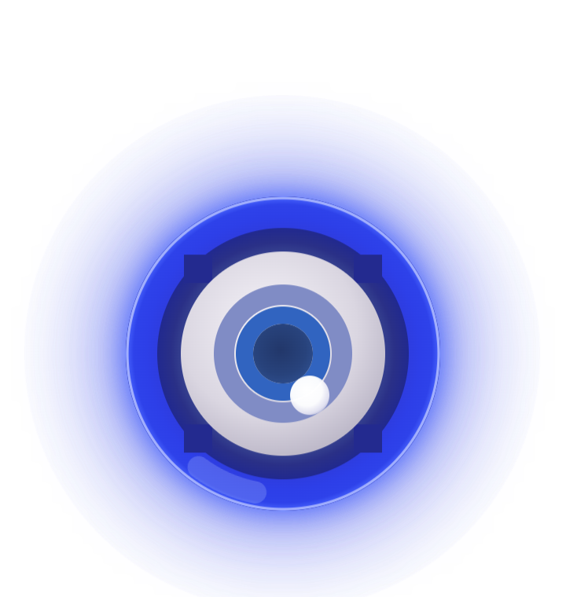
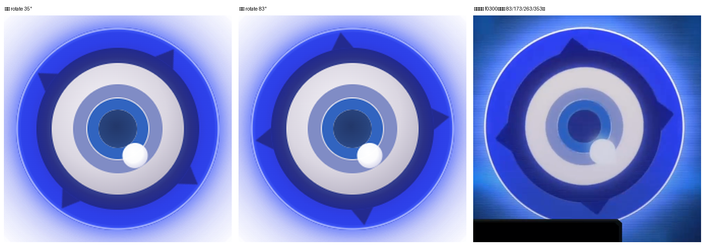
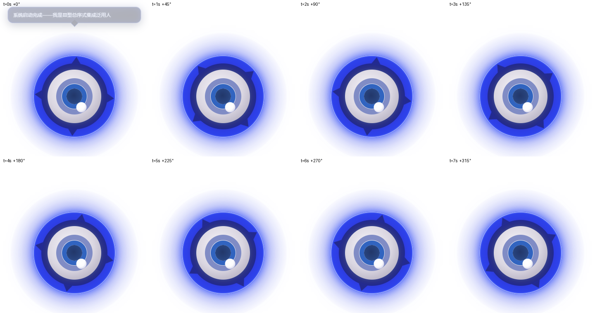
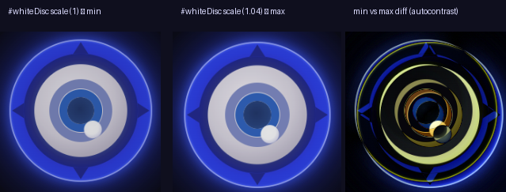
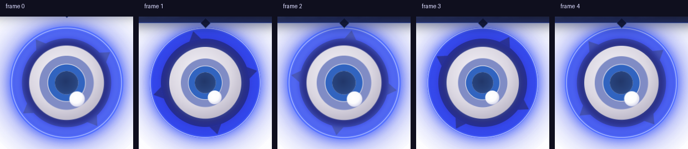

# Fairy 桌宠 (fairy_pet)

> *Fairy 是一段超规格程序。她不眨眼睛、不追视线、不旋转扫描。她只是呼吸。*

一个仿《绝区零》H.D.D. 系统里 **Fairy** 形象的桌面宠物。
透明无边框 Electron 窗口，纯 SVG + CSS keyframe 动画，数据全部来自对官方实机录像的逐帧量化测量。



---

## 这是什么

透明窗口、常驻桌面右下、可拖拽的双击/右键交互的 Fairy。
所有视觉元素（眼瞳、虹膜、白盘、暗蓝环带、亮蓝外环、四个尖刺）都用 `<circle>` + `<path>` + SVG 渐变画出来，
动画只用 CSS `@keyframes` + `transform`，没有精灵图、没有贴图、没有 GIF/WebM。

结构（同心）：

| 名称 | viewBox 半径 | 颜色 | 动画 |
|---|---|---|---|
| 外发光（#halo） | inset -14% | 蓝紫 radial | 0.86s `pulse`（opacity/scale） |
| 暗蓝底层（#gDark）| 100 | 暗蓝 radial | 静止 |
| 亮蓝外环（#brightRing） | r=90, sw=20 | 亮蓝 radial | 0.86s `ringBreathe`（r 90↔91.5, sw 20↔22）|
| 四尖刺（#corners） | 尖端 r=96 | `#232A8F` + mask r>79.5 | **8.0s 顺时针 `cornersSpin`**（45°/s） |
| **白盘（#whiteDisc）** | **r=65** | 白 radial | **0.86s `whiteDiscPulse`**（scale 1↔1.04） |
| 环辉光（#ringGlow） | r=90 | `#8AA6FF` | 0.86s `glowPulse`（opacity .05↔.40） |
| 虹膜 4 圈（#irisPulse） | r 19/24.5/37.5/glint 12.5 | 蓝/深蓝 radial | 0.86s `irisScale`（1↔1.12）|

0.86s 同步呼吸组覆盖虹膜、外环、辉光、外发光、**白盘** —— 整只眼睛像在同步呼吸。
尖刺是独立 8 秒匀速旋转（4 重对称、对齐实机 BV1CkcbzgEkC 实测 45°/s）。

---

## 一句话价值

> 桌宠的形象不靠猜、不靠脑补。**每一像素都对得上 B 站实机录像的逐帧数据。**
> 谁都能跑分析脚本复现结论。

---

## 三轮逐帧分析的关键结论

### 1. 几何量化（外圈细白线 = 100 归一化）

| | 比例 | 含义 |
|---|---|---|
| 白盘外缘 | 56.2 | 白盘占整体 56% 半径（**当前桌宠 r=65/120 ≈ 54.2%，略小**，有 2 个单位的还原度差距，待主人决策） |
| 暗蓝环带外缘 | 79.3 | 亮蓝环内缘 |
| 外圈细白线 | 100 | 外缘 |

### 2. 四尖刺在旋转（不是脉动）

| 真相 | 数据 |
|---|---|
| 角速度 | 45°/s（顺时针） |
| 周期 | **8.0 s** |
| 4 尖等距 | 90° |
| 尖端外径 | ~0.96×outer |
| 基部宽度 | ~15° |

**踩坑记录（重要）**：第一版我误判「尖刺不旋转、是 2.0s 收缩」，原因是：
1. 直接对**原始角向剖面**求 4 次谐波 → 静态环带形状本身的 4 次谐波（振幅 0.23）远大于旋转分量（0.05），相位被"焊死"。
2. 用固定角度窗口取最大半径 → 4 尖等距时**90°/45°=2.0s 就有尖刺经过**，误读成「2.0s 伸缩」。

**正确方法**：每帧减去**时间中值基线**得残差，再对残差做 4 次谐波相位 **连续解卷绕** → 12s 内相位推进 6 圈。
参看 `docs/process/02_尖刺相位对齐_桌宠vs视频.png` —— 桌宠 rotate(83°) 与视频 f0300 帧的尖刺方位完美重合。





### 3. 白盘其实也在呼吸

> 主人原话：「我看原版中白色部分也会随着变化，你再看看。」

第一版我把白盘当成"恒定大小"——是错的。
300 帧 × 8 方位、20 样本滑动均值去趋势后 FFT：
- 白盘外缘 0° 主峰 f=1.13Hz (**0.88s**), p=25835
- 虹膜核心 0° 主峰 f=1.20Hz (**0.83s**), p=55158
- 亮蓝环内缘 f=1.20Hz (**0.83s**), p=86638

**三组主峰差 < 2 个频率 bin，全部在 0.86±0.02s，与现有 0.86s 同步呼吸组完全同频。**
白盘外缘 std ≈ 3-5px / 中位 105px → 半径 ±3-5%（面积 ±6-10%），幅度比虹膜 (±13.3% 面积) 克制。

实现：`#whiteDisc { animation: whiteDiscPulse 0.86s ease-in-out infinite; }` 关键帧 `scale 1 ↔ 1.04`。
关键 CSS 技巧：`transform-box: fill-box; transform-origin: center;` —— 让 scale 围绕白盘几何中心，不依赖 viewBox 120px 写法。

| 验证产物 | 内容 |
|---|---|
| `docs/process/04_白盘缩放_min_vs_max.png` | CSS 强制 `#whiteDisc { scale(1) }` vs `scale(1.04)` 对照 —— diff 区域集中在白盘环周，SVG bbox 由 203² 涨到 213² |
| `docs/process/05_白盘_全程动画_5帧live.png` | 不冻结任何动画，连续 5 帧（t=0/430/860/1290/1720ms），相邻帧 max diff 437-555、65-78% 像素变化 |





### 4. 视线跟随：全屏识别（不只是窗口内部）

实机 egg.mp4 里眼睛**完全不动**（主人决策暂保留克制的低频跟随以让 pet 有"活着"的感觉）。
实现要点：

| 难点 | 解法 |
|---|---|
| 透明窗口 `setIgnoreMouseEvents(true)` 时，鼠标在窗外收不到任何 `mousemove` | 主进程 `screen.getCursorScreenPoint()` **30Hz** 主动推 |
| 几何基准切换 | 按**屏幕工作区半宽**归一化（不再是 pet 窗口半宽 120px） |
| 离 pet 很远时回正 | `dist > scrW * 1.5` 时 nx/ny=0 |
| 拖拽自身时不浪费 CPU | IPC `cursor-broadcast` 临时开关 |

档位：30Hz / `max=5` SVG 单位（克制）/ 单屏（`getPrimaryDisplay`）；多屏如要可扩。

---

## 目录结构

```
fairy_pet/
├── renderer/                 # 渲染层（Electron loadURL('renderer/index.html')）
│   ├── index.html            # SVG markup
│   ├── style.css             # 所有动画 + 视觉
│   └── app.js                # 鼠标交互/拖拽/右键菜单
├── main.js                   # Electron 主进程（透明窗口、置顶、skipTaskbar、IPC）
├── preload.js                # contextBridge，暴露 window.api
├── 启动 Fairy.bat             # 一键启动
├── package.json              # Electron 44
├── assets/                   # 静态资源（官方参考立绘在 npc_fairy_ref.png）
├── docs/process/             # 重要过程图（提交到 git）
├── *.py                      # 全部逐帧分析脚本（可复跑，提交到 git）
├── 进度与待办.md              # 完整技术档案
└── (已 .gitignore) frames_*/ ref_video/ node_modules/ verify_*/ 等
```

---

## 跑起来

需要 Node 18+、npm。

```bash
# 安装依赖（仅 electron）
npm install

# 启动（Fairy 透明窗口出现在右下）
双击 启动 Fairy.bat
# 或
npm start
```

交互：
- 双击 Fairy：显示/隐藏气泡
- 左键拖拽：移动 pet
- 右键：菜单
- 30s 未交互：进入"休眠"态，4 个动画同步暂停，filter 降饱和变暗

---

## 复现分析结论

所有量化结论都可复跑（前提：先安装 Python + numpy + Pillow + opencv-python + playwright）：

```bash
# 1. 抽帧 BV1CkcbzgEkC（iris_pulse 实机录像）
python extract_hifps2.py

# 2. 量化尖刺旋转（残差 4 次谐波相位 + 连续解卷绕）
python corner_angles.py
python corner_angles2.py

# 3. 量化白盘 0.86s 呼吸
python disc_pulse_analysis.py

# 4. Playwright 验证桌宠实机
python verify_white_disc2_minmax.py   # 强制 min vs max 对照
python verify_white_disc_live.py      # 全程动画 5 帧对照
```

---

## 已知偏差 / 待决策

| 项 | 偏差 | 原因 |
|---|---|---|
| 白盘半径 | r=65 → 设计应为 r≈56 | 实机 56.2% / 当前 54.2%；改不改观感差异明显，待主人决策 |
| 尖刺长度 | 等长 | 实机因透视 W/N/E/S 不等（0.97/0.92/...）；桌宠正视圆形，暂按等长 |
| 旋转方向 | 顺时针 | 与实机一致；若主人看着别扭，改 `animation-direction` |

---

## 关键参考

- **BV1CkcbzgEkC** —— 2.6 版立绘对比视频，"右侧"为桌宠形态。`ref_video/iris_pulse.f30080.mp4`。`frames_hifps2/` 是这份视频 60fps 抽帧 0-15s 共 900 帧。
- **BV131421k7xW** —— H.D.D. 屏挂机彩蛋（egg.mp4），143s 全程，证实眼睛不眨、不追视线、无旋转扫描。
- **assets/npc_fairy_ref.png** —— 萌娘百科官方 2.6 版立绘（配色采样源）。

---

## License

MIT. `assets/npc_fairy_ref.png` 与 `ref_video/` 下的实机录像版权归《绝区零》/米哈游所有，仅作个人学习用途，请勿商用。
